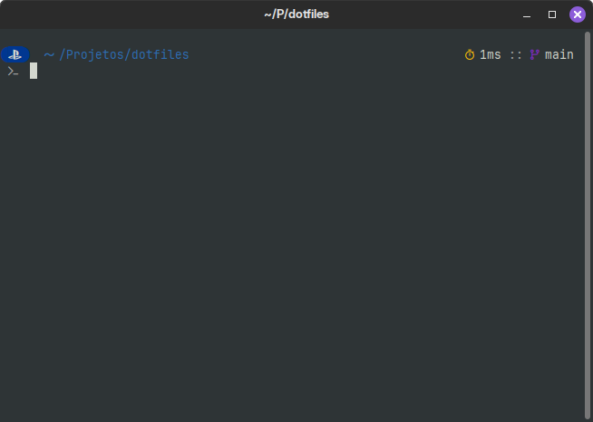

# Firehawk's dotfiles

In case you live under a rock or aren't into Linux (or perhaps *NIXes in general), dotfiles are how *NIX folks personalize their systems, its similar to what you would sometimes do in a graphical interface on Windows, I guess. Here's mine small set of customizations.

## Whats included?

Lets take an unnecessary dive into what's included:

-   **.config directory**: Well, these are the dotfiles _per se_. I just kept them inside where they'll be when installed because I'm doing this repo on a hurry and I'll probably refactor everything sometime in the future. And by future I mean somewhere in time before I die, so it might take _a while_.
-   **.config/fish**: My fish shell settings. It already includes [fisher](https://github.com/jorgebucaran/fisher) and [nvm.fish](https://github.com/jorgebucaran/nvm.fish), with nvm already setup to use latest version in fish_variables. I guess I'm **this** lazy to keep this, I'm honestly not even sure it'll work when/if I need to setup fish later.
-   **.config/starship.toml**: Along with fish, I also use [starship](https://starship.rs/) because _oh my god_ it is so goddamn easy to setup with the toml thing. I started using it with Windows but I carried it to Linux because, well, it just works for what I need. Oh, and it looks like this:



-   **images**: kinda self explanatory, isn't it? But anyway, here I'll keep screenshots when they're needed (like the one right above here) -**setup.sh**: The install script for my dotfiles
-   **update.sh**: Contradictory to what the name may imply, the update script is meant to pull changes from my starship and fish settings into the repository so I can easily update the repo. It's like the apex lazyness right here on your face, because copying stuff over here is too peasant-y.

## Installing

Quite simple, to be honest. Do this:

```
cd /tmp
git clone https://github.com/RenanLazarotto/dotfiles.git
cd dotfiles
./setup.sh
```

It **_should_** work, I don't know. Like I said, I created this on a hurry and my testing was mostly done by running the script and seeing if there where any errors on its output, not actually testing if it done what it was meant to do.

---

<div align="center">
<b style="color:red; font-size:1.5rem">WARNING: THIS **WILL** OVERWRITE YOUR FILES!</b>
</div>

---

Please please **_pleeeeeeeease_** use this carefully. These are meant to be the dotfiles I use on my machines, suitable for my needs. They're here because I got tired of using a secret gist to keep all my dotfiles and needed something that could set the most basic stuff quickly.

I didn't take into account any kind of backup, and I'm not sure if I'll ever do because thats kinda why I'm using git in the first place - I can just revert stuff if something doesn't work the way I expect.
